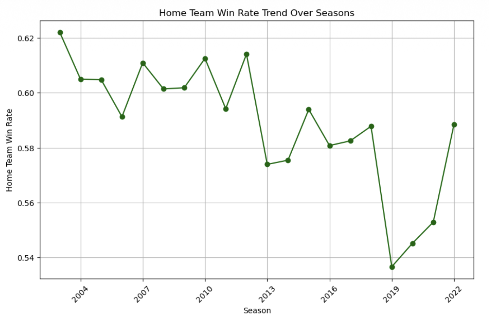
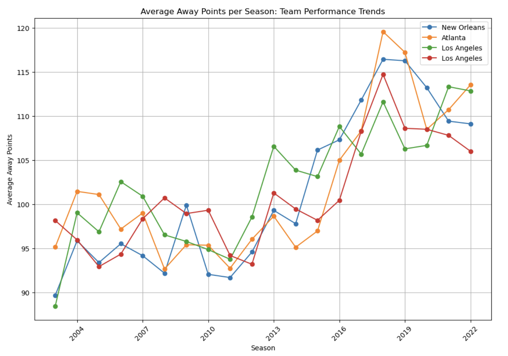
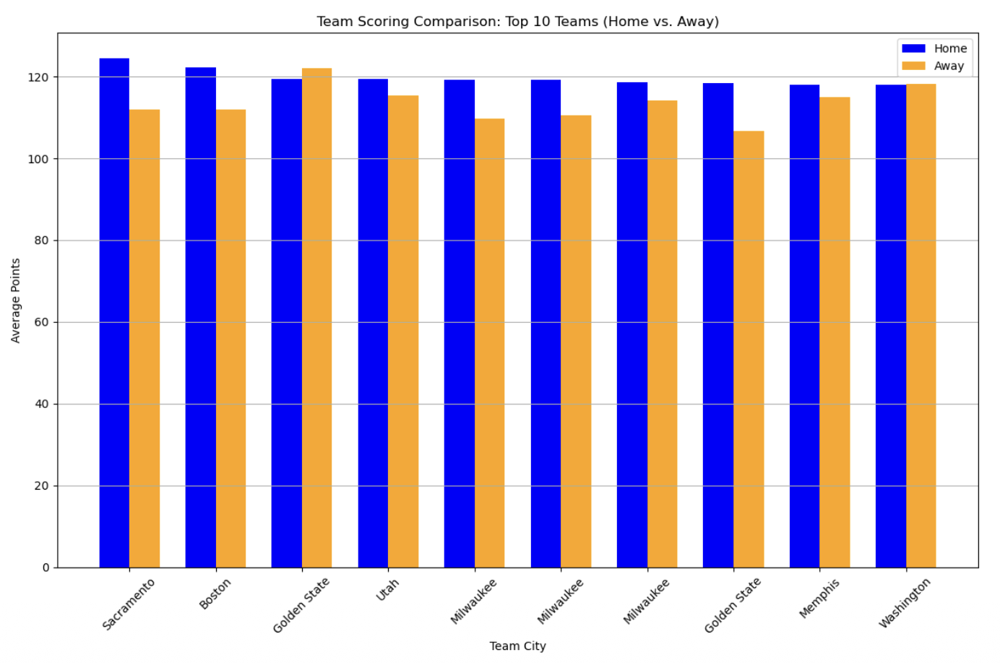
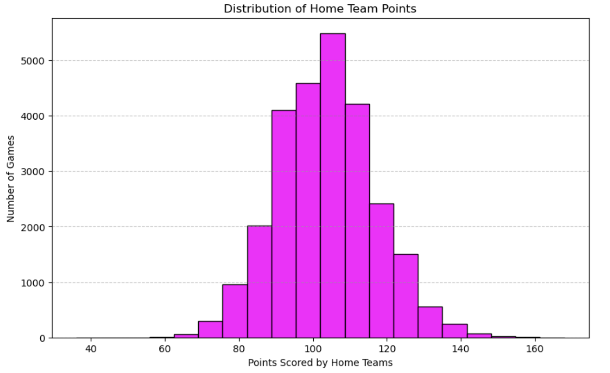
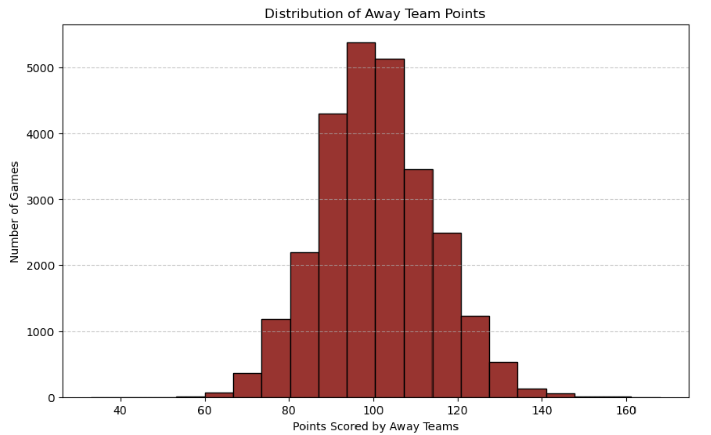
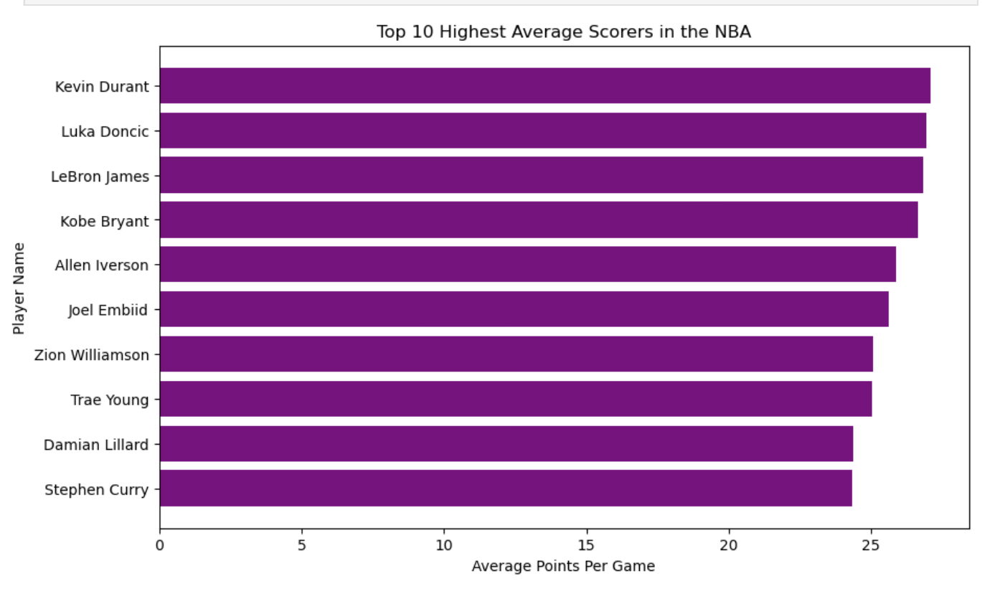

# NBA Performance Analysis – Understanding Scoring Patterns

## Project Overview
This project analyzes NBA game and player data to uncover scoring patterns and performance trends.  
The goal is to understand how game location (home vs away), team consistency, and player performance influence scoring, and to test whether game outcomes can be predicted using historical scoring averages.

## Research Questions
- Do home teams consistently score more points than away teams?
- Which city teams have the highest average points across all games?
- Who are the highest average scorers in the NBA?
- Which seasons had the highest average scoring for each city?
- How are home and away team points distributed?
- Can we predict game outcomes using teams’ past average points?

## Data
This project uses three datasets:
- `games.csv` (game-level details: home/away teams, points, season, outcomes)
- `games_details.csv` (player-level stats per game)
- `players.csv` (player info by season)

**Source:** “NBA games data” by Nathan Lauga (Kaggle, 2020).

## Methodology
- Cleaned missing values in team and player point columns
- Exploratory analysis comparing home vs away scoring
- Team and season scoring trends by city
- Top scorers analysis using average points per game
- Distribution analysis using histograms (home and away points)
- Feature engineering: expanding mean of team points (shifted to avoid data leakage)
- Logistic Regression model to predict home team win

## Key Findings
- Home teams score slightly higher on average (~103.46) than away teams (~100.64)
- Home win rate was above ~60% in earlier seasons and decreased over time
- Scoring trends increased across many teams over time
- Logistic Regression achieved ~57% accuracy and predicted home wins better than losses

## Tools Used
- Python
- pandas
- matplotlib
- scikit-learn

## Visualizations
### Home Team Win Rate Trend Over Seasons

### Average Away Points by Season

### Home vs Away Scoring (Top 10 Teams)

### Home Team Points Distribution

### Away Team Points Distribution

### Top 10 Highest Average Scorers

## Reference
Lauga, N. (2020). *NBA games data* (Version 10) [Data set]. Kaggle.
